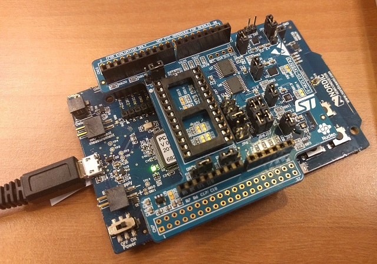
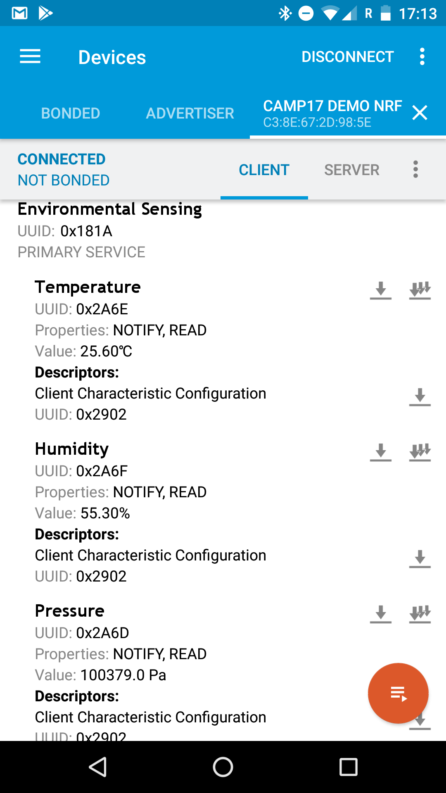

# Demo App
The demo app is based on Mbed-OS 5. The app offers a Bluetooth LE Service which provides environmental sensor information.

## Supported Target
[Nordic nRF52-DK](https://developer.mbed.org/platforms/Nordic-nRF52-DK/) with [X-NUCLEO-IKS01A2](https://developer.mbed.org/components/X-NUCLEO-IKS01A2/) shield

<!-- image with size params should be included with html syntax -->

## Build
* run ``build.cmd`` located in DemoApp/
  * [build.cmd](DemoApp/build.cmd)
* More Informamtion [Custom Setup with GNU ARM embedded Toolchain](mbed.md)

## Deploy
* Connect dev board via USB to computer
* run ``deploy.cmd`` located in DemoApp/
* Application is installed and started automatically

## Read sensor data
* Install nRF Connect on Android Smartphone
* Scan for devices
* Connect to **CAMP17 DEMOAPP**

